ai4building  ·  Digital Twin System

**energyMatrix**

**FIN Pod 详细设计说明书**

数据接口 · Fantom 类设计 · 前端骨架 · 部署与时序

版本 V0.1.1

西门子中国

2026 年 9 月

# 文档信息
| **项目** | **内容** |
| --- | --- |
| 文档名称 | energyMatrix FIN Pod 详细设计说明书 |
| 文档编号 | AI4B-EM-DD-2026-001 |
| 版本 | V1.0 |
| 密级 | 公司内部 |
| 上游文档 | AI4B-EM-DS-2026-001《energyMatrix 语义模型设计说明书》V0.1.1 |
| 覆盖范围 | 数据接口设计、Fantom 后台类设计、前端路由与功能设计、部署与关键流程时序 |
| 不覆盖范围 | 语义模型定义（见上游文档）、控制逻辑与寻优算法（见 CoolMatrix / heatMatrix 设计说明）、UI 视觉规范（见界面设计说明） |
| 技术栈 | Fantom / FIN Framework 5.x / Haxall · Xeto 5.0 · React 18 + TypeScript · Folio |
| 编制单位 | 西门子中国 · ai4building |

## 修订记录
| **版本** | **日期** | **修订内容** | **编制** |
| --- | --- | --- | --- |
| V0.1 | 2026-09 | 接口清单与类设计草案 | 架构组 |
| V1.0 | 2026-09 | 补充 UML 类图、时序图、部署图与非功能设计 | 架构组 |
| V0.1.1 | 2026-09 | 新增能流图（Sankey）屏设计；版本统一为 0.1.1；公司主体变更为西门子中国 | 架构组 |

# 目录

- **1  引言**
  - 1.1  编制目的与范围
  - 1.2  设计原则
  - 1.3  技术栈与约束
- **2  系统架构**
  - 2.1  逻辑架构
  - 2.2  部署架构
  - 2.3  运行时与并发模型
  - 2.4  Pod 工程结构
- **3  Fantom 后台设计**
  - 3.1  领域与持久层
  - 3.2  计算引擎层
  - 3.3  服务接口层
  - 3.4  类职责说明
  - 3.5  任务调度与事务
  - 3.6  异常与错误码
- **4  数据接口设计**
  - 4.1  接口总则
  - 4.2  REST 接口清单
  - 4.3  关键接口定义
  - 4.4  Axon 函数库
  - 4.5  Haystack Ops 约定
  - 4.6  外部系统集成接口
- **5  前端设计**
  - 5.1  工程结构与分层
  - 5.2  路由骨架
  - 5.3  模块功能说明
  - 5.4  数据获取与缓存
  - 5.5  角色与权限矩阵
- **6  关键流程时序**
  - 6.1  台账生成与关账
  - 6.2  分摊执行与红冲
  - 6.3  账单生成
  - 6.4  基线拟合与核证
  - 6.5  诊断到工单闭环
- **7  非功能设计**
  - 7.1  容量估算
  - 7.2  性能目标
  - 7.3  可用性与故障恢复
  - 7.4  安全与审计
- **8  开发与交付计划**
- **附录 A  错误码表**
- **附录 B  前端路由全量清单**

# 1  引言
## 1.1  编制目的与范围
本文档是 energyMatrix 的软件详细设计说明，向下对接编码实现，向上承接《energyMatrix 语义模型设计说明书》所定义的两层语义模型。上游文档回答“数据长什么样”，本文档回答“程序怎么组织、接口怎么调、进程怎么部署”。

交付对象包括 Fantom 后台开发、React 前端开发、测试、实施部署与第三方系统对接方。

## 1.2  设计原则
- 语义模型是唯一真源。所有类的字段与接口的字段一律从 Xeto spec 派生，禁止在代码中新增模型未定义的业务字段。
- 引擎无状态，上下文显式传递。所有计算引擎通过 EmCalcCtx 接收边界、账期与幂等键，不持有跨调用的可变状态。
- 写操作幂等。所有产生台账条目的接口必须携带幂等键，重复提交不产生重复条目。
- 账务层不进控制环。energyMatrix 永不写控制点，实时安全回路不依赖本 Pod 的任何计算结果。
- 边缘可离线。边缘节点在与中心断连期间继续采集与本地缓存，恢复后按序补传，不因网络中断丢失计量数据。

## 1.3  技术栈与约束
| **层** | **技术选型** | **约束** |
| --- | --- | --- |
| 运行时 | FIN Framework 5.x / Haxall，Fantom 1.0.8x | Pod 形式部署，不引入外部 JVM 容器 |
| 数据 | Folio（rec + his） | 不引入独立关系库；台账即 Folio rec |
| 语义 | Xeto 5.0，lib em 0.1.0 | 依赖 sys、ph、ph.points、ph.equips |
| 计算 | Fantom 内置 + ONNX Runtime（基线推理） | 模型工件外置，代码不内嵌系数 |
| 接口 | REST / JSON + Haystack Ops (Zinc, JSON) | 统一走 FIN 鉴权，不另起认证体系 |
| 前端 | React 18 + TypeScript + Vite | 单页应用，构建产物随 Pod 发布 |
| 图表 | 自研 SVG 原语 | 不引入重型图表库，保证视觉一致性 |

表 1-1  技术栈与约束

# 2  系统架构
## 2.1  逻辑架构
系统自上而下分五层。表现层与服务接口层之间只有 HTTPS/JSON 一种通道；计算引擎层不直接访问 Folio，一律经 EmRepo；数据接入层复用 FIN 既有连接器，本 Pod 不自研任何现场协议驱动。

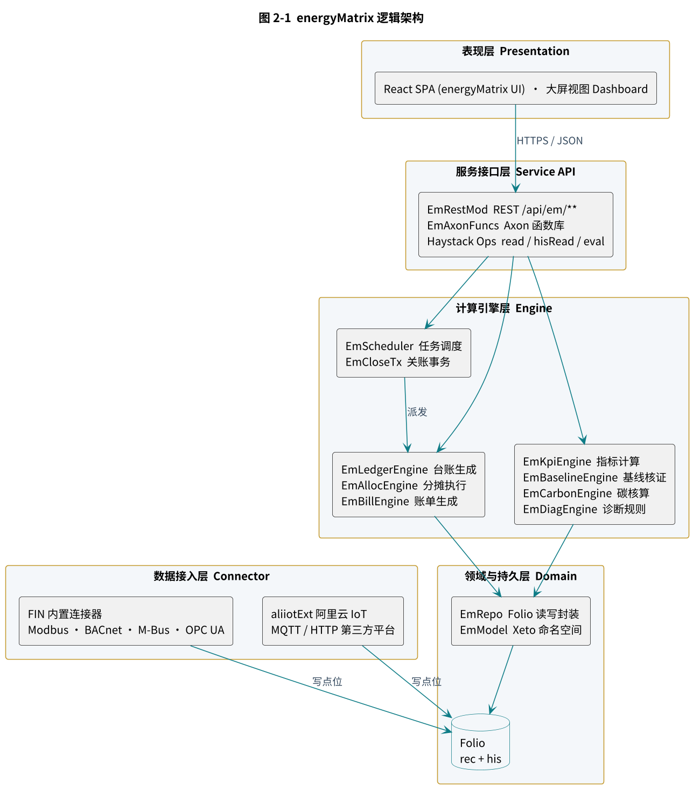

图 2-1  energyMatrix 逻辑架构

## 2.2  部署架构
采用边缘加中心的两级部署。边缘节点（AI-BOX / NEXIO）负责采集、本地缓存与断网续传；中心节点（阿里云 ECS）承载主 Folio、计算引擎与对外接口。两级之间通过 FIN 复制机制同步，仅开放 443 出方向，现场侧不暴露任何入方向端口。

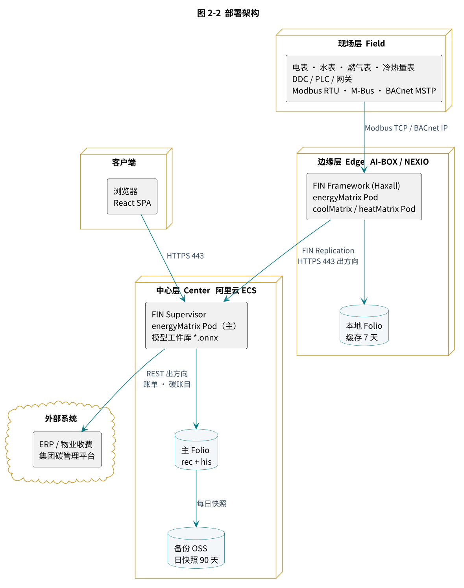

图 2-2  部署架构

| **节点** | **配置建议** | **职责** |
| --- | --- | --- |
| 边缘 AI-BOX | 4 核 / 8 GB / 128 GB SSD | 协议采集、点位归一、本地 Folio 缓存 7 天、断网续传 |
| 中心 ECS | 8 核 / 32 GB / 500 GB ESSD | 主 Folio、全部计算引擎、REST 接口、模型推理 |
| 备份 | OSS 标准存储 | 每日 Folio 快照，保留 90 天；月度归档保留 5 年 |
| 客户端 | Chrome 110 及以上 | React SPA，最小分辨率 1440×900 |

表 2-1  部署节点配置

## 2.3  运行时与并发模型
EmExt 作为 HxLib 子类在 Pod 启动时注册，持有 EmRepo、EmModel 与 EmScheduler 三个长生命周期对象。所有重计算走 EmScheduler 这一 Actor，串行化到单一消息队列，避免同一账期被并发重算。

| **机制** | **实现** | **说明** |
| --- | --- | --- |
| 调度 | EmScheduler extends Actor | cron 定时与手工提交统一入队，队列深度上限 64 |
| 幂等 | idempotencyKey = sha1(op + siteRef + span + granularity) | 队列内去重，已完成任务 24 小时内重复提交直接返回原结果 |
| 事务 | Folio 批量 commit，每批 2000 条 | EmCloseTx 内任一步骤失败即回滚本批，已提交批次通过红冲撤销 |
| 长任务 | Future + 进度回写 EmCalcResult | 前端轮询 /api/em/jobs/{id} 获取进度 |
| 房务 | onHouseKeeping 每 10 分钟 | 清理过期 Future、重推失败的外部推送队列 |

表 2-2  运行时机制

## 2.4  Pod 工程结构
| energyMatrix/ build.fan                 # Fantom 构建脚本 lib/em/*.xeto             # Xeto 语义库（见上游文档） fan/ EmExt.fan               # HxLib 入口 domain/                 # EmRec 及其子类、EmRepo、EmModel engine/                 # EmEngine 及七个引擎、EmCloseTx、EmScheduler api/                    # EmRestMod、EmHandler 及七个子类 axon/                   # EmAxonFuncs export/                 # EmExportSvc util/                   # EmError、EmAudit、EmPrincipal、EmFormulaEval test/                     # Fantom 单元测试 ui/                       # React 工程，构建产物输出至 res/ res/                      # 前端静态资源、默认诊断规则、示例费率 |
| --- |

# 3  Fantom 后台设计
## 3.1  领域与持久层
EmRec 是所有领域对象的抽象基类，封装 Folio Dict 与强类型访问器。领域对象一律 const class，不可变；修改通过构造新实例并 commit 完成。EmRepo 是唯一的 Folio 访问出口，引擎层不得直接持有 Folio 引用。

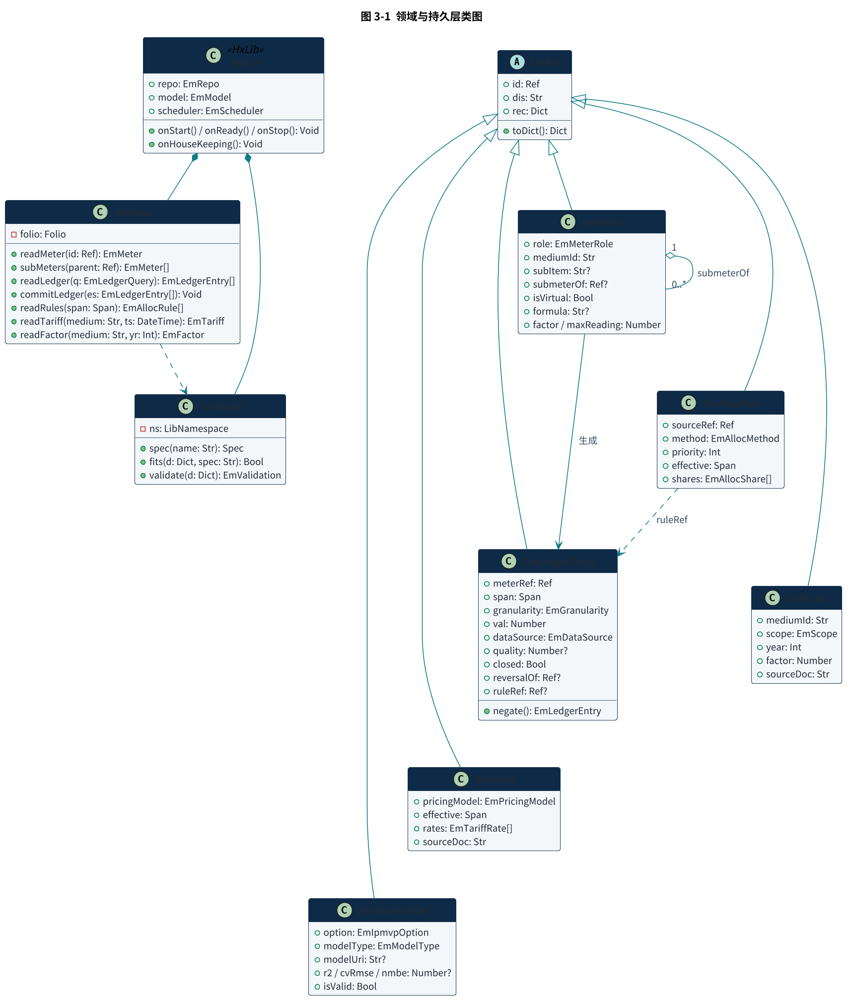

图 3-1  领域与持久层类图

## 3.2  计算引擎层
所有引擎继承 EmEngine，统一 run(ctx) 签名，统一返回 EmCalcResult。EmCloseTx 不是引擎，而是编排关账四步骤的事务对象，它按顺序调用 EmLedgerEngine 与 EmAllocEngine，并在第四步执行缺口率闸门。

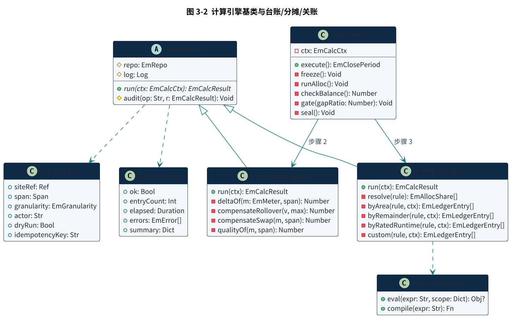

图 3-2  计算引擎基类与台账、分摊、关账

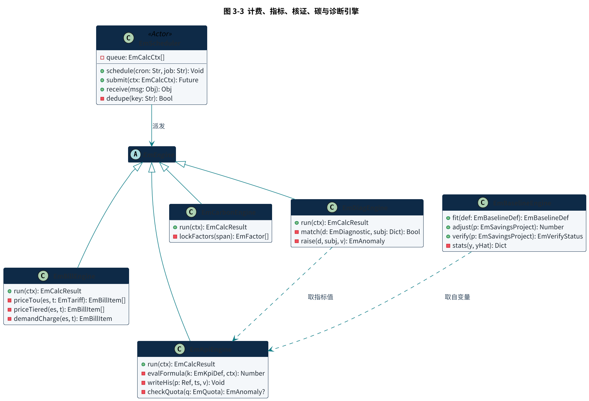

图 3-3  计费、指标、核证、碳与诊断引擎

## 3.3  服务接口层
EmRestMod 是 WebMod 子类，负责路由、鉴权与序列化；每个业务域对应一个 EmHandler 子类。EmAxonFuncs 以静态方法加 @Axon facet 暴露同一批能力给 Axon 脚本与 FIN 规则引擎，二者共享引擎实现，不存在两套逻辑。

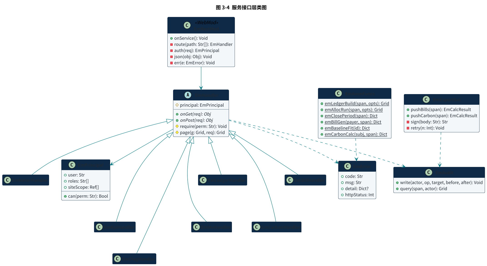

图 3-4  服务接口层类图

## 3.4  类职责说明
| **类** | **层** | **职责** | **关键约束** |
| --- | --- | --- | --- |
| EmExt | 入口 | Pod 生命周期、服务注册、房务任务 | onStart 内不执行重计算 |
| EmRepo | 持久 | Folio 读写唯一出口、批量提交 | commitLedger 强制校验 emDataSource 非空 |
| EmModel | 持久 | Xeto 命名空间访问与 rec 校验 | 写入前 fits 校验失败即拒绝 |
| EmRec | 领域 | Dict 封装与强类型访问 | const class，不可变 |
| EmMeter | 领域 | 计量对象，含角色、介质、父表与倍率 | submeterOf 跨介质即校验失败 |
| EmLedgerEntry | 领域 | 台账条目，含 negate 红冲构造 | closed 为真时任何修改抛 EM-3003 |
| EmEngine | 引擎 | 引擎抽象基类，统一 run 与审计 | 禁止持有可变状态 |
| EmLedgerEngine | 引擎 | L2 delta 转台账，含溢出与换表补偿 | quality 低于阈值标 estimated |
| EmAllocEngine | 引擎 | 七种分摊方法执行 | 结果条目必带 ruleRef |
| EmCloseTx | 引擎 | 关账四步骤编排与缺口率闸门 | gate 不通过即整体回滚 |
| EmBillEngine | 引擎 | 台账乘费率生成账单 | 账期未关账拒绝出账 |
| EmKpiEngine | 引擎 | 指标计算与定额校验 | 写 L3 归一化点 |
| EmBaselineEngine | 引擎 | 基线拟合、调整与核证 | 未通过统计验收不得置 verified |
| EmCarbonEngine | 引擎 | 碳账计算与因子版本锁定 | 因子缺依据文号即拒绝 |
| EmDiagEngine | 引擎 | 诊断规则匹配与事件生成 | 只产生事件，不写控制点 |
| EmScheduler | 引擎 | Actor 队列、cron、幂等去重 | 队列满返回 EM-9002 |
| EmFormulaEval | 工具 | Axon 表达式编译与求值 | 沙箱内执行，禁止 IO |
| EmRestMod | 接口 | 路由、鉴权、序列化、错误映射 | 所有写接口校验幂等键 |
| EmHandler | 接口 | 业务域处理器基类，分页与权限 | require 未通过抛 EM-2001 |
| EmAxonFuncs | 接口 | Axon 函数库 | 与 REST 共享引擎实现 |
| EmPrincipal | 工具 | 身份、角色与站点范围 | siteScope 为空即拒绝所有查询 |
| EmError | 工具 | 错误码、消息与 HTTP 状态映射 | 对外不暴露堆栈 |
| EmAudit | 工具 | 操作审计写入与查询 | 关账、红冲、费率变更强制审计 |
| EmExportSvc | 接口 | 账单与碳账外推，签名与重试 | 幂等键为业务单号 |

表 3-1  类职责说明

## 3.5  任务调度与事务
| **任务** | **Cron 表达式** | **说明** |
| --- | --- | --- |
| 日台账生成 | 0 10 1 * * * | 每日 01:10 生成前一日 daily 条目 |
| 结算表小时台账 | 0 5 * * * * | 每小时第 5 分钟生成结算表 hourly 条目 |
| 诊断规则执行 | 0 15 1 * * * | 每日 01:15，紧随台账生成 |
| 月度关账 | 手工触发 | 由能源经理在前端发起，不自动关账 |
| 账单生成 | 0 30 2 1 * * | 每月 1 日 02:30，前置校验上月已关账 |
| 碳账计算 | 0 45 2 1 * * | 每月 1 日 02:45 |
| 基线重拟合 | 0 0 3 1 1,7 * | 每半年一次，结果需人工确认后生效 |
| 外推重试 | onHouseKeeping | 每 10 分钟扫描失败队列 |

表 3-2  调度任务清单

| **事务边界** Folio 无跨 rec 事务，关账的原子性由 EmCloseTx 在应用层保证：每批 2000 条提交，记录批次游标；任一步骤失败时，已提交批次不做物理删除，而是逐批生成红冲条目撤销，并将 EmClosePeriod 标记为 failed。这与红冲机制一致，保证任何中间态都可审计。 |
| --- |

## 3.6  异常与错误码
所有异常统一收敛为 EmError，携带错误码、面向用户的消息、结构化明细与 HTTP 状态。对外响应不暴露 Fantom 堆栈，堆栈只写入服务端日志。完整错误码见附录 A。

| { "error": { "code": "EM-3002", "msg": "缺口率 6.37% 超过阈值 5%，关账已阻断", "detail": { "gapRatio": 0.0637, "limit": 0.05, "unbalanced": ["M-B1-01", "M-D2-01"] } } } |
| --- |

# 4  数据接口设计
## 4.1  接口总则
| **项** | **约定** |
| --- | --- |
| 基址 | https://{host}/api/em/v1 |
| 鉴权 | 复用 FIN 会话 Cookie 或 Bearer Token，不另建认证体系 |
| 内容类型 | application/json; charset=utf-8 |
| 时间格式 | ISO 8601 带时区，如 2026-07-01T00:00:00+08:00 |
| 账期参数 | span=2026-07 或 span=2026-07-01..2026-08-01，左闭右开 |
| 分页 | ?page=1&limit=200，响应头返回 X-Total-Count，limit 上限 1000 |
| 幂等 | 写接口必带 Idempotency-Key 头，24 小时内重复键返回原结果 |
| 排序 | ?sort=-ts,val，减号表示降序 |
| 版本 | 路径内 v1；不兼容变更升版本，兼容变更只增字段不改语义 |
| 错误 | HTTP 状态 + error 对象，见 3.6 节 |

表 4-1  接口总则

## 4.2  REST 接口清单
| **方法** | **路径** | **说明** | **权限** |
| --- | --- | --- | --- |
| GET | /meters | 计量对象列表，支持按角色、介质、分项筛选 | em:read |
| GET | /meters/{id} | 计量对象详情，含 Xeto spec 与点位配置 | em:read |
| GET | /meters/{id}/tree | 以该表为根的 submeterOf 子树 | em:read |
| GET | /meters/{id}/quality | 指定账期的数据完好率与断点明细 | em:read |
| POST | /meters/import | 点表批量导入，返回校验结果 | em:admin |
| GET | /ledger/entries | 台账流水查询 | em:read |
| POST | /ledger/build | 生成指定账期台账条目 | em:calc |
| POST | /ledger/close | 关账，执行四步骤与缺口率闸门 | em:close |
| POST | /ledger/reverse | 红冲指定条目 | em:close |
| GET | /ledger/periods | 关账批次列表，含缺口率 | em:read |
| GET | /ledger/gap | 缺口分析，返回未平衡表计清单 | em:read |
| GET | /alloc/rules | 分摊规则列表 | em:read |
| POST | /alloc/rules | 新建分摊规则 | em:admin |
| PUT | /alloc/rules/{id} | 修改规则，自动创建新版本 | em:admin |
| POST | /alloc/run | 执行分摊，支持 dryRun 预览 | em:calc |
| GET | /tariffs | 费率方案列表 | em:read |
| POST | /tariffs | 新建费率，emSourceDoc 必填 | em:admin |
| GET | /bills | 账单列表 | em:bill |
| GET | /bills/{id} | 账单详情，含逐项 ledgerRefs | em:bill |
| POST | /bills/generate | 生成账单 | em:bill |
| POST | /bills/{id}/issue | 开具账单，触发外推 | em:bill |
| GET | /kpi/definitions | 指标定义列表 | em:read |
| GET | /kpi/values | 指标时序值查询 | em:read |
| POST | /kpi/calc | 触发指标计算 | em:calc |
| GET | /kpi/quotas | 定额列表与执行进度 | em:read |
| GET | /mv/baselines | 基线列表 | em:read |
| POST | /mv/baselines/{id}/fit | 基线拟合，返回统计验收结果 | em:mv |
| GET | /mv/projects | 节能措施列表，含三态节能量 | em:read |
| POST | /mv/projects/{id}/verify | 节能量核证 | em:mv |
| GET | /carbon/accounts | 碳账目查询 | em:read |
| POST | /carbon/calc | 碳账计算并锁定因子版本 | em:calc |
| GET | /carbon/factors | 排放因子列表 | em:read |
| POST | /carbon/factors | 新增因子，emSourceDoc 必填 | em:admin |
| GET | /diag/anomalies | 诊断事件列表 | em:read |
| POST | /diag/anomalies/{id}/ack | 确认事件 | em:ops |
| POST | /diag/workorders | 创建工单 | em:ops |
| GET | /jobs/{id} | 长任务进度查询 | em:read |

表 4-2  REST 接口清单（37 项）

## 4.3  关键接口定义
### 4.3.1  关账  POST /ledger/close
| Request POST /api/em/v1/ledger/close Idempotency-Key: 3f2a9c1e-... { "siteRef": "@p:demo:r:2b8c-site", "span": "2026-07", "granularity": "monthly", "gapLimit": 0.05, "dryRun": false } Response 200 { "closePeriodId": "@p:demo:r:9a11-close", "span": "2026-07", "entryCount": 99000, "gapRatio": 0.0397, "gapVal": 77000, "unit": "kWh", "closedBy": "jack", "closedAt": "2026-08-01T02:14:33+08:00", "elapsedMs": 58210 } Response 409  缺口率超限 { "error": { "code": "EM-3002", ... } }   // 见 3.6 节 |
| --- |

### 4.3.2  台账流水  GET /ledger/entries
| GET /api/em/v1/ledger/entries?span=2026-07&subItem=B1&limit=200&sort=-val Response 200 { "total": 4, "rows": [ { "id": "@p:demo:r:L-2607-0143", "meterRef": "@p:demo:r:M-B1-01", "meterDis": "冷热站总表", "mediumId": "elec", "subItem": "b1", "span": "2026-07-01..2026-08-01", "granularity": "monthly", "val": 612000, "unit": "kWh", "dataSource": "measured", "quality": 1.0, "closed": true, "reversalOf": null, "ruleRef": null } ] } |
| --- |

### 4.3.3  红冲  POST /ledger/reverse
| POST /api/em/v1/ledger/reverse { "entryId": "@p:demo:r:L-2607-0151", "reason": "完好率 64.1%，补采后重录" } Response 200 { "reversalId": "@p:demo:r:L-2607-0152", "originId": "@p:demo:r:L-2607-0151", "val": -96400, "note": "原条目保留不删，等待以实测重录" } |
| --- |

### 4.3.4  节能量核证  POST /mv/projects/{id}/verify
| Response 200 { "projectId": "@p:demo:r:ecm-coolplant", "ipmvpOption": "optionC", "baselineValid": true, "stats": { "r2": 0.93, "cvRmse": 0.084, "nmbe": 0.012 }, "savingsPlanned": 186000, "savingsMeasured": 92400, "savingsVerified": 78600, "unit": "kWh", "verifyStatus": "verified", "verifiedAt": "2026-08-05T10:02:11+08:00" } |
| --- |

| **接口约束** 凡返回 savings 相关字段的接口，必须同时返回 verifyStatus。前端与第三方在 verifyStatus 不等于 verified 时，一律以“规划目标”标注展示，禁止以节能量口径呈现。该约束在接口契约层强制，不依赖调用方自觉。 |
| --- |

## 4.4  Axon 函数库
| **函数** | **签名** | **说明** |
| --- | --- | --- |
| emLedgerBuild | (span, opts: {siteRef, granularity}) → Grid | 生成台账条目 |
| emClosePeriod | (span, opts: {gapLimit}) → Dict | 执行关账四步骤 |
| emReverse | (entryId: Ref, reason: Str) → Dict | 红冲条目 |
| emGapReport | (siteRef: Ref, span) → Grid | 缺口分析 |
| emAllocRun | (span, opts: {ruleId, dryRun}) → Grid | 执行分摊 |
| emAllocPreview | (ruleId: Ref, span) → Grid | 分摊预览，不落库 |
| emBillGen | (payerRef: Ref, span) → Dict | 生成账单 |
| emTariffApply | (entries: Grid, tariffId: Ref) → Grid | 对给定条目试算电费 |
| emKpiCalc | (kpiId: Ref, subjectRef: Ref, span) → Grid | 指标计算 |
| emQuotaCheck | (quotaId: Ref) → Dict | 定额进度校验 |
| emBaselineFit | (baselineId: Ref) → Dict | 基线拟合与统计验收 |
| emBaselinePredict | (baselineId: Ref, vars: Dict) → Number | 基线预测 |
| emSavingsVerify | (projectId: Ref) → Dict | 节能量核证 |
| emCarbonCalc | (subjectRef: Ref, span) → Dict | 碳账计算并锁定因子 |
| emFactorLock | (span) → Grid | 返回本期锁定的因子版本 |
| emDiagRun | (span, opts: {ruleId}) → Grid | 执行诊断规则 |
| emAnomalyAck | (anomalyId: Ref, note: Str) → Dict | 确认事件 |
| emMeterTree | (rootRef: Ref) → Grid | 返回计量子树 |
| emLedgerQuery | (siteRef, span, dim) → Grid | 台账多维聚合查询，dim 取 meter 时供能流图取值 |
| emMeterQuality | (meterRef: Ref, span) → Dict | 数据完好率 |
| emExportPush | (target: Str, span) → Dict | 手工触发外推 |

表 4-3  Axon 函数库（21 项）

能流图（Sankey，V0.1.1 新增，见 5.3）数据契约：结构取自 emMeterTree（列：id、dis、emMedium、emMeterRole、submeterOf、emDepth、emVirtual、emGap、emChildCount），数值取自 emLedgerQuery（dim 取 meter）。只读，不新增 Axon 函数、不新增后端接口。

## 4.5  Haystack Ops 约定
读取类需求一律复用 Haystack 标准 Ops，不另建接口。本 Pod 只新增两个自定义 Op，用于前端一次性获取结构化结果。

| **Op** | **类型** | **用途** |
| --- | --- | --- |
| read | 标准 | 按 filter 查询 rec，如 emLedger and span=="2026-07" |
| hisRead | 标准 | 读取 L1 累积读数与 L3 指标点历史 |
| eval | 标准 | 执行 Axon 表达式，供高级用户与规则引擎使用 |
| emLedgerQuery | 自定义 | 带分页、多维筛选与汇总的台账查询，避免前端多次 read |
| emCloseStatus | 自定义 | 返回指定站点各账期关账状态与缺口率，供前端顶栏状态灯 |

表 4-4  Haystack Ops 约定

## 4.6  外部系统集成接口
| **方向** | **对方系统** | **协议与内容** | **触发与重试** |
| --- | --- | --- | --- |
| 入 | 现场表计 | Modbus RTU/TCP、BACnet、M-Bus、OPC UA，经 FIN 连接器 | 按连接器轮询周期，默认 15 分钟 |
| 入 | 阿里云 IoT | aliiotExt，MQTT 订阅 | 实时推送，断连由连接器重连 |
| 入 | 第三方 IoT 平台 | HTTP 轮询或 MQTT，经专用连接器 | 按平台约定，默认 5 分钟 |
| 入 | ERP 租户主数据 | REST 拉取，每日 03:00 | 失败重试 3 次，失败保留上次快照 |
| 出 | 物业收费系统 | REST 推送账单，HMAC-SHA256 签名，幂等键为账单号 | 账单开具时触发，重试 3 次，退避 5s/25s/125s |
| 出 | 集团碳管理平台 | REST 推送碳账目，含因子版本号 | 碳账计算完成后触发，同上重试策略 |
| 出 | 大屏与第三方 BI | 只读 REST 或 Haystack Ops，独立只读账号 | 调用方自行拉取，限流 60 次/分钟 |

表 4-5  外部系统集成接口

# 5  前端设计
## 5.1  工程结构与分层
前端分四层：基础层提供设计令牌、接口客户端、权限守卫与缓存；图表原语层是自研 SVG 组件，不依赖第三方图表库；业务组件层按域组织；路由层只负责装配。业务组件不直接调用 fetch，一律经 ApiClient。

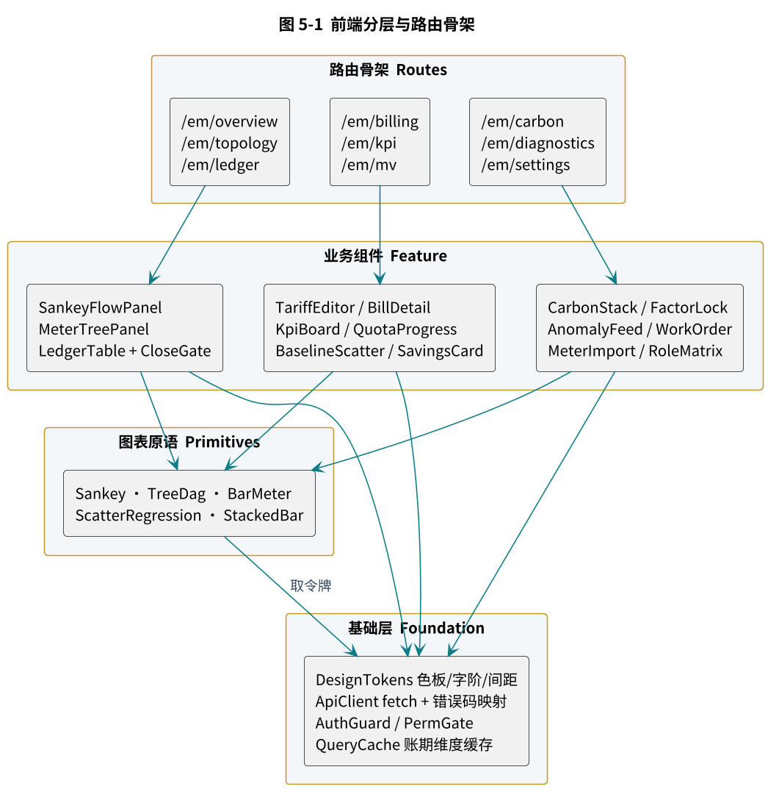

图 5-1  前端分层与路由骨架

| ui/src/ tokens/         # 色板、字阶、间距、阴影 api/            # ApiClient、错误码映射、类型定义（由 Xeto 生成） auth/           # AuthGuard、PermGate、角色上下文 cache/          # QueryCache，按 站点 + 账期 维度失效 charts/         # Sankey、TreeDag、ScatterRegression、StackedBar、BarMeter features/ overview/  topology/  ledger/  billing/ kpi/       mv/        carbon/  diagnostics/  settings/ routes/         # 路由表与懒加载 App.tsx |
| --- |

## 5.2  路由骨架
路由以 /em 为前缀，十个一级模块，二级路由承载详情与子视图。全量清单见附录 B。

| /em /overview                        能源总览（默认路由） /topology                        计量拓扑 /:meterId                      表计详情 /ledger /entries                       台账流水 /close                         关账闸门 /gap                           缺口分析 /billing /tariffs        /tariffs/:id   费率方案 /alloc-rules    /alloc-rules/:id 分摊规则 /bills          /bills/:id     账单 /kpi /indicators     /quotas        指标与定额 /mv /baselines/:id  /projects/:id  基线与节能措施 /carbon /accounts  /factors  /certs    碳账、因子、绿证 /diagnostics /anomalies  /workorders        事件与工单 /settings /meters-import  /permissions  /schedules /flow                        能流图（Sankey） |
| --- |

## 5.3  模块功能说明
| **模块** | **核心功能** | **写操作** | **关键呈现约束** |
| --- | --- | --- | --- |
| 能源总览 | 能流桑基、分项下钻、多介质用量、缺口告警 | 无 | 缺口以独立断流呈现，不并入任一分项 |
| 能流图 | 能源流向 Sankey、按介质分色、缺口断流汇入不明用能、tooltip 表计名与能耗 | 无 | 流向宽度取 L2 台账合计；考核表不参与汇总；空台账给引导不白屏 |
| 计量拓扑 | submeterOf 树、表计详情、数据完好率、虚表公式 | 无 | 虚表与物理表视觉可区分 |
| 台账与关账 | 流水查询、关账闸门、红冲、缺口分析 | 关账、红冲 | 缺口率未达标时关账按钮禁用 |
| 计费 | 费率维护、分摊规则、账单生成与开具 | 费率、规则、账单 | 费率无依据文号不允许保存 |
| 指标与定额 | 指标看板、对标排名、定额进度 | 定额下达 | 不同定额来源分色标注 |
| 基线与核证 | 基线拟合、统计验收、节能量三态 | 拟合、核证 | 未核证节能量必须标注为规划目标 |
| 碳资产 | Scope 构成、因子版本锁、绿证抵消 | 因子、绿证 | 因子来源文号随值展示 |
| 诊断与工单 | 事件流、确认、派单、转措施 | 确认、派单 | 估算影响量标注为估算，不进账 |
| 系统设置 | 点表导入、权限、调度计划 | 全部 | 点表导入先校验后落库 |

表 5-1  模块功能说明

## 5.4  数据获取与缓存
| **数据类别** | **获取方式** | **缓存策略** |
| --- | --- | --- |
| 已关账台账 | GET /ledger/entries | 长缓存，按 站点+账期 键，关账后不再变化 |
| 未关账台账 | GET /ledger/entries | 短缓存 60 秒，页面聚焦时重新拉取 |
| 计量树 | GET /meters/{id}/tree | 会话级缓存，点表变更时手工失效 |
| 指标时序 | GET /kpi/values | 按指标加对象加账期缓存，5 分钟 |
| 长任务进度 | GET /jobs/{id} | 不缓存，2 秒轮询，任务结束即停 |
| 诊断事件 | GET /diag/anomalies | 不缓存，30 秒轮询 |

表 5-2  数据获取与缓存策略

能流图前端取数契约（emApi 薄封装，V0.1.1）：`emMeterTree(siteRef)` 取结构、`emLedgerAggregate(siteRef, span, "meter")` 取量值，mobx Store 内合并后经纯函数 buildSankey 转为 recharts Sankey 的 {nodes, links}。

## 5.5  角色与权限矩阵
| **模块** | **查看者** | **运维** | **计费专员** | **能源经理** | **管理员** |
| --- | --- | --- | --- | --- | --- |
| 能源总览 | 读 | 读 | 读 | 读 | 读 |
| 计量拓扑 | 读 | 读 | 读 | 读 | 读写 |
| 台账流水 | 读 | 读 | 读 | 读 | 读 |
| 关账与红冲 | — | — | — | 执行 | 执行 |
| 费率与分摊规则 | — | — | 读写 | 读 | 读写 |
| 账单 | — | — | 读写 | 读 | 读写 |
| 指标与定额 | 读 | 读 | 读 | 读写 | 读写 |
| 基线与核证 | 读 | — | — | 执行 | 执行 |
| 碳资产 | 读 | — | 读 | 读写 | 读写 |
| 诊断与工单 | 读 | 读写 | — | 读 | 读写 |
| 系统设置 | — | — | — | — | 读写 |

表 5-3  角色与权限矩阵

权限点与后端 em:read、em:ops、em:bill、em:calc、em:close、em:mv、em:admin 一一对应。前端 PermGate 仅负责隐藏入口，所有校验以后端 EmHandler.require 为准。

# 6  关键流程时序
## 6.1  台账生成与关账
关账是本系统最重的一次写操作，四个步骤严格串行，第四步的缺口率闸门是唯一的阻断点。

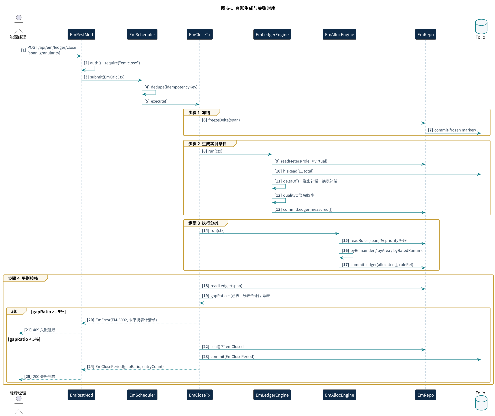

图 6-1  台账生成与关账时序

## 6.2  分摊执行与红冲
分摊默认先以 dryRun 预览，确认后再落库。已关账条目发现错误时走红冲，未关账条目直接重算，二者在接口层区分，避免误用。

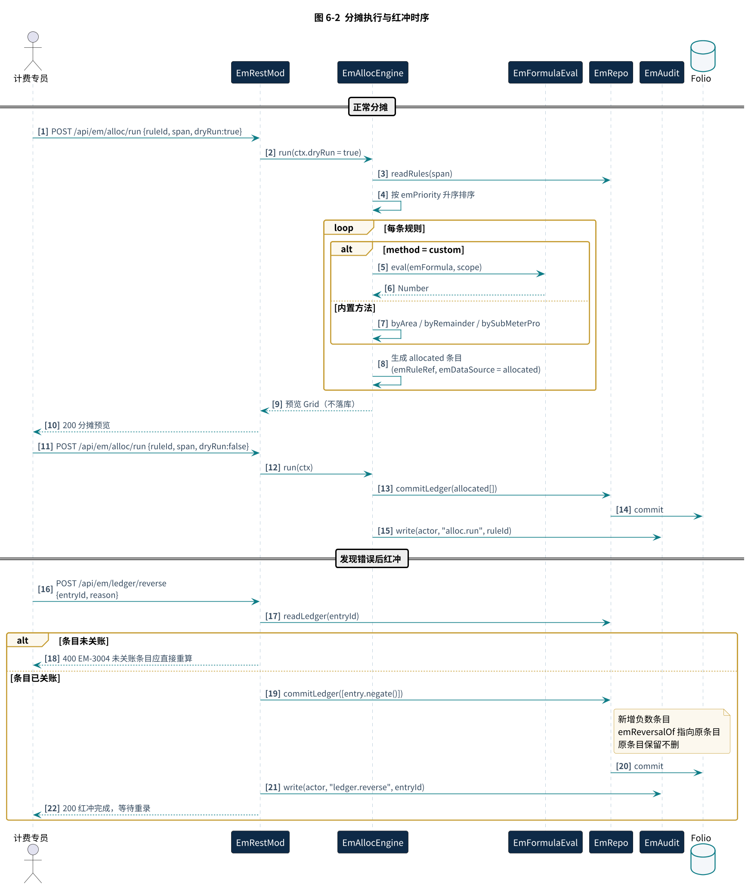

图 6-2  分摊执行与红冲时序

## 6.3  账单生成
账单生成有两道前置校验：账期必须已关账，费率必须有依据文件号。外推采用幂等键加指数退避重试。

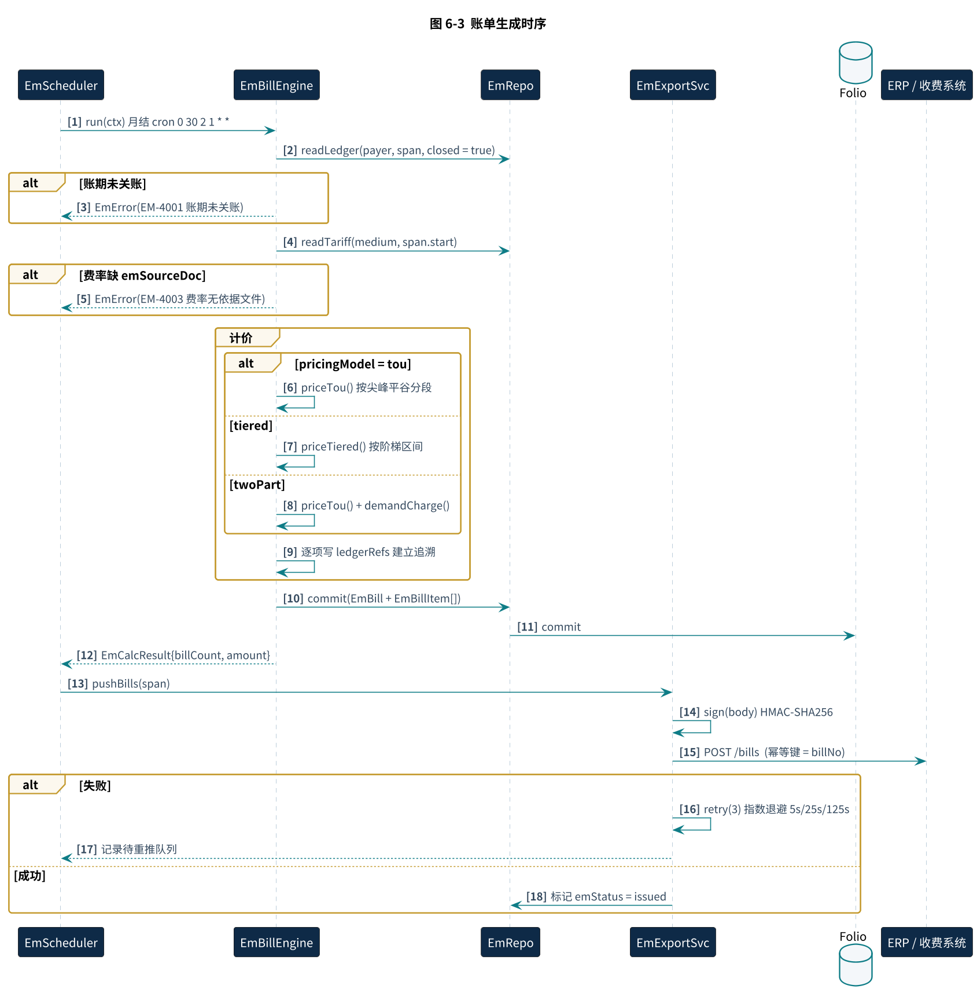

图 6-3  账单生成时序

## 6.4  基线拟合与核证
基线未通过 ASHRAE Guideline 14 统计验收时，emValid 置假，引用该基线的核证请求一律拒绝，节能量保持规划目标状态。

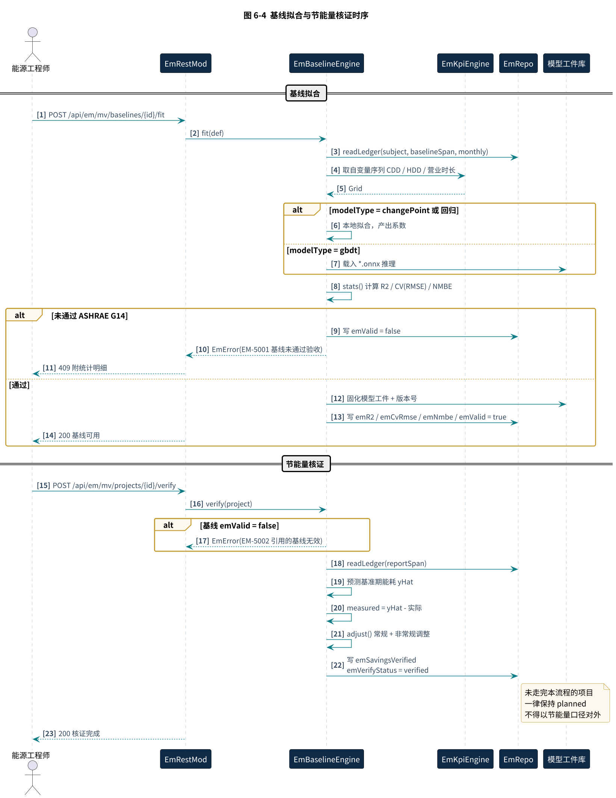

图 6-4  基线拟合与节能量核证时序

## 6.5  诊断到工单闭环
诊断引擎只产生事件。跨产品的控制策略调整由人工在 CoolMatrix 侧发起，energyMatrix 不写任何控制点。

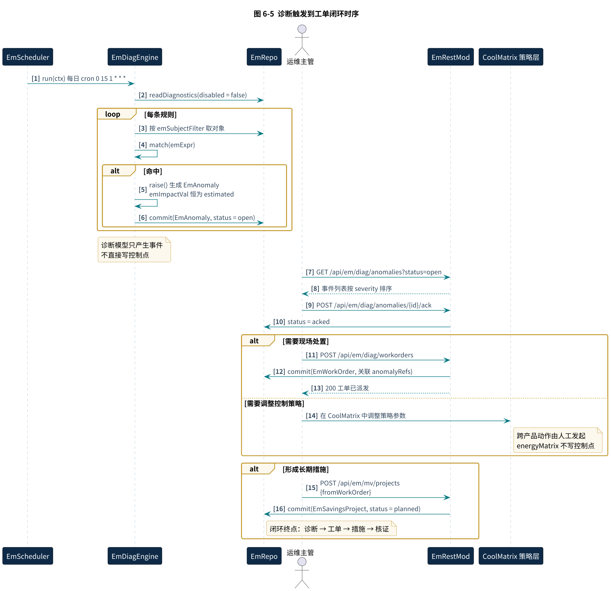

图 6-5  诊断触发到工单闭环时序

# 7  非功能设计
## 7.1  容量估算
以下估算基于典型商业综合体规模假设，用于确定台账落库粒度（对应上游文档待决事项 OI-01）与硬件选型。所有数值为按公式推算的工程估算值，需在集成测试阶段以实测压测结果修正。

| **参数** | **取值** | **来源** |
| --- | --- | --- |
| 计量表计数 N | 1,500 只 | 假设，按 18.6 万平方米综合体典型配置 |
| 平均点位数 | 6 点/表 | 假设，电表 9 点、水气表 2 点加权 |
| 采样周期 | 15 分钟 = 96 次/日 | 点位规范默认值 |
| 结算表占比 | 5%（75 只） | 假设，关口表加结算子表 |

表 7-1  容量估算输入假设

| **项** | **计算式** | **结果** |
| --- | --- | --- |
| 历史记录写入 | 1,500 × 6 × 96 | 864,000 条/日 |
| 历史记录年量 | 864,000 × 365 | 3.15 亿条/年 |
| 历史存储年增 | 864,000 × 24 B × 365 | 约 7.6 GB/年 |
| 台账 · 全量 hourly | 1,500 × 24 × 30 | 1,080,000 条/月 |
| 台账 · 全量 daily | 1,500 × 30 | 45,000 条/月 |
| 台账 · 结算表 hourly | 75 × 24 × 30 | 54,000 条/月 |
| 台账 · 混合策略合计 | 45,000 + 54,000 | 99,000 条/月 |
| 混合与全量 hourly 之比 | 99,000 ÷ 1,080,000 | 9.2% |

表 7-2  容量估算结果

| **OI-01 结论** 采用混合策略：全部表计按 daily 粒度落台账，结算类表计（gateway 与 settlement）额外按 hourly 落台账，小时级明细统一保留在历史库不入账。台账条目量降至全量 hourly 方案的 9.2%，约 119 万条/年，Folio 可控。该结论为规划取值，待压测验证后固化。 |
| --- |

## 7.2  性能目标
| **场景** | **规模** | **目标** | **依据** |
| --- | --- | --- | --- |
| 月度关账 | 99,000 条 | P95 ≤ 90 秒 | 按单条 0.6 ms 估算约 59 秒，预留 50% 余量 |
| 台账查询 | 单页 200 条 | P95 ≤ 500 ms | 带索引 Folio 查询经验值 |
| 总览页首屏 | 桑基加四张指标板 | P95 ≤ 1.5 秒 | 已关账数据走长缓存 |
| 基线拟合 | 12 个月样本 | ≤ 10 秒 | 回归本地计算；gbdt 走 ONNX 推理 |
| 诊断全量执行 | 1,500 只表 × 8 类规则 | ≤ 5 分钟 | 夜间窗口执行，不与交互争抢 |
| 接口并发 | 50 并发只读 | 错误率 < 0.1% | 单中心节点，超出走限流 |

表 7-3  性能目标（规划值，待压测验证）

## 7.3  可用性与故障恢复
| **故障场景** | **影响** | **处置** |
| --- | --- | --- |
| 边缘与中心断连 | 中心侧数据滞后 | 边缘本地 Folio 缓存 7 天，恢复后按时间序补传，台账重算幂等 |
| 中心节点宕机 | 接口不可用 | ECS 快照恢复，Folio 每日快照 + 增量日志，RPO ≤ 1 小时，RTO ≤ 2 小时 |
| 关账中途失败 | 账期处于中间态 | 已提交批次逐批红冲撤销，EmClosePeriod 标记 failed，可重新发起 |
| 外推目标不可用 | 账单未送达 | 进入重试队列，房务任务每 10 分钟重推，超过 24 小时告警 |
| 模型工件缺失 | 基线预测不可用 | 核证请求返回 EM-5003，节能量保持规划目标状态，不降级为估算值 |
| 表计长期离线 | 数据完好率下降 | 低于阈值的条目标 estimated，不参与结算，并触发 dataQuality 诊断 |

表 7-4  故障场景与处置

## 7.4  安全与审计
- 传输全程 HTTPS，边缘至中心仅开放 443 出方向，现场侧不暴露入方向端口。
- 权限以站点为范围边界，EmPrincipal.siteScope 为空时拒绝所有查询，不存在越权的默认全量视图。
- 关账、红冲、费率变更、因子变更、节能量核证五类操作强制写审计，记录操作人、时间、变更前后值。
- 审计日志只增不改，保留期 5 年，与台账归档周期一致。
- 对外接口不返回 Fantom 堆栈；服务端日志中的表计编号与租户名称在导出时脱敏。
- 外推签名采用 HMAC-SHA256，密钥按对接方独立配置，不复用。

# 8  开发与交付计划
以下为规划工期，单位为周，按两名 Fantom 开发加一名前端开发估算，未含现场调试与验收。

| **里程碑** | **内容** | **工期** | **交付物** |
| --- | --- | --- | --- |
| M1 | Xeto 库落地、连接器接入、点表导入与校验 | 4 | em 0.1.0 库、点表导入工具 |
| M2 | EmRepo、EmLedgerEngine、EmCloseTx、关账闸门 | 4 | 台账与关账可用 |
| M3 | EmAllocEngine 七种方法、EmBillEngine、费率维护 | 3 | 分摊与账单可用 |
| M4 | EmKpiEngine、定额、对标 | 2 | 指标看板可用 |
| M5 | EmBaselineEngine、ONNX 推理、核证流程 | 3 | 基线与核证可用 |
| M6 | EmCarbonEngine、因子版本锁、绿证 | 2 | 碳账可用 |
| M7 | EmDiagEngine、事件与工单闭环 | 2 | 诊断闭环可用 |
| M8 | 前端九模块整合、权限、压测与调优 | 3 | 完整系统与压测报告 |
| 合计 | — | 23 | — |

表 8-1  里程碑计划（规划值）

| **依赖前置** M2 的关账闸门依赖现场计量方案达到可平衡状态。若首轮缺口率长期高于 5%，需先补齐计量点位或增设虚表，该工作不在软件工期内，应在项目计划中单列。 |
| --- |

# 附录 A  错误码表
| **错误码** | **HTTP** | **含义** | **处置建议** |
| --- | --- | --- | --- |
| EM-1001 | 400 | 参数缺失或格式错误 | 检查请求体字段 |
| EM-1002 | 400 | 账期格式非法 | 使用 2026-07 或起止日期区间 |
| EM-1003 | 400 | 缺少幂等键 | 写接口必带 Idempotency-Key |
| EM-2001 | 403 | 权限不足 | 检查角色与权限点 |
| EM-2002 | 403 | 站点范围外访问 | 检查 siteScope 配置 |
| EM-3001 | 409 | 账期已关账 | 如需修改请走红冲 |
| EM-3002 | 409 | 缺口率超限，关账阻断 | 查看未平衡表计清单，补齐计量或增设虚表 |
| EM-3003 | 409 | 已关账条目不可修改 | 改用红冲接口 |
| EM-3004 | 400 | 未关账条目不应红冲 | 直接重算即可 |
| EM-3005 | 422 | 计量树跨介质挂接 | 修正 submeterOf |
| EM-3006 | 422 | 数据完好率低于阈值 | 条目已标 estimated，补采后重录 |
| EM-4001 | 409 | 账期未关账，不可出账 | 先执行关账 |
| EM-4002 | 404 | 未找到适用费率 | 检查费率生效期 |
| EM-4003 | 422 | 费率缺少依据文件号 | 补填 emSourceDoc |
| EM-4004 | 409 | 账单已开具，不可重复生成 | 如需修改请作废后重开 |
| EM-5001 | 409 | 基线未通过统计验收 | 查看 R2、CV(RMSE)、NMBE 明细 |
| EM-5002 | 409 | 引用的基线无效 | 先重新拟合基线 |
| EM-5003 | 503 | 模型工件缺失或加载失败 | 检查模型工件库路径与版本 |
| EM-5004 | 409 | 报告期与基准期重叠 | 调整实施期与报告期边界 |
| EM-6001 | 422 | 排放因子缺少依据文件号 | 补填 emSourceDoc |
| EM-6002 | 404 | 未找到适用年份或区域的因子 | 补充因子记录 |
| EM-6003 | 409 | 绿证未注销，不可用于抵消 | 先完成注销核销 |
| EM-7001 | 422 | 分摊规则冲突 | 调整 emPriority 或生效期 |
| EM-7002 | 422 | 分摊份额合计不为一 | 检查 emShares |
| EM-8001 | 502 | 外部系统推送失败 | 已入重试队列，超 24 小时告警 |
| EM-9001 | 500 | 内部错误 | 查看服务端日志 |
| EM-9002 | 429 | 调度队列已满 | 稍后重试 |
| EM-9003 | 429 | 接口限流 | 降低调用频率 |

# 附录 B  前端路由全量清单
| **路由** | **组件** | **权限** | **说明** |
| --- | --- | --- | --- |
| /em/overview | OverviewPage | em:read | 能源总览，默认路由 |
| /em/topology | TopologyPage | em:read | 计量树 |
| /em/topology/:meterId | MeterDetailPage | em:read | 表计详情与完好率 |
| /em/ledger/entries | LedgerEntriesPage | em:read | 台账流水 |
| /em/ledger/close | ClosePeriodPage | em:close | 关账闸门 |
| /em/ledger/gap | GapAnalysisPage | em:read | 缺口分析 |
| /em/billing/tariffs | TariffListPage | em:bill | 费率列表 |
| /em/billing/tariffs/:id | TariffEditorPage | em:admin | 费率编辑 |
| /em/billing/alloc-rules | AllocRuleListPage | em:bill | 分摊规则列表 |
| /em/billing/alloc-rules/:id | AllocRuleEditorPage | em:admin | 规则编辑与预览 |
| /em/billing/bills | BillListPage | em:bill | 账单列表 |
| /em/billing/bills/:id | BillDetailPage | em:bill | 账单详情与追溯 |
| /em/kpi/indicators | KpiBoardPage | em:read | 指标看板 |
| /em/kpi/quotas | QuotaPage | em:read | 定额与进度 |
| /em/mv/baselines | BaselineListPage | em:read | 基线列表 |
| /em/mv/baselines/:id | BaselineDetailPage | em:mv | 拟合与统计验收 |
| /em/mv/projects | SavingsListPage | em:read | 节能措施列表 |
| /em/mv/projects/:id | SavingsDetailPage | em:mv | 三态节能量与核证 |
| /em/carbon/accounts | CarbonAccountPage | em:read | 碳账目 |
| /em/carbon/factors | FactorPage | em:read | 因子版本锁 |
| /em/carbon/certs | GreenCertPage | em:read | 绿证与抵消 |
| /em/diagnostics/anomalies | AnomalyPage | em:read | 诊断事件 |
| /em/diagnostics/workorders | WorkOrderPage | em:ops | 工单 |
| /em/settings/meters-import | MeterImportPage | em:admin | 点表导入 |
| /em/settings/permissions | PermissionPage | em:admin | 角色与权限 |
| /em/settings/schedules | SchedulePage | em:admin | 调度计划 |
| /em/flow | FlowPage | em:read | 能流图（Sankey），流向带宽∝台账能耗 |
